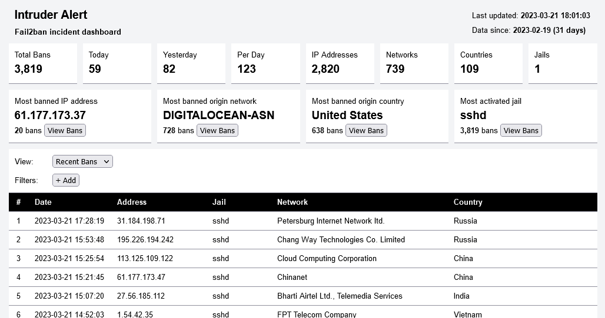

# Intruder Alert


Intruder Alert is an incident dashboard for Fail2ban.

## Frontend

Browser-based dashboard for viewing the data report created by the backend.

The dashboard fetches the report by requesting `backend\data.php`, make sure it is accessible via HTTP.

## Backend

PHP script for parsing Fail2ban logs and generating the report.

## Installation

Clone the repository.

```
git clone {path here}
```

Install dependencies with composer in the backend folder.

```
composer install --no-dev
```

## Configuration

Use ` backend/config.php` (copied from [`backend/config.example.php`](backend/config.example.php)) to set the configuration.

| Name                  | Description                                                                   |
| --------------------- | ----------------------------------------------------------------------------- |
| `LOG_FOLDER`          | Path of the Fail2ban logs folder.                                             |
| `ASN_DATABASE`        | Path of the GeoLite2 ASN database file.                                       |
| `COUNTRY_DATABASE`    | Path of the GeoLite2 Country database file.                                   |
| `TIMEZONE`            | Timezone (optional) ([php docs](https://www.php.net/manual/en/timezones.php)) |
| `SYSTEM_LOG_TIMEZONE` | Timezone of fail2ban logs (optional, default is UTC)                          |

GeoLite2 databases can be [downloaded](https://dev.maxmind.com/geoip/geolite2-free-geolocation-data?lang=en) from MaxMind.

## Running

The backend script `backend\script.php` is designed to be used with a task scheduler like cron.

Cron example:

`1 * * * * cd intruder-alert/backend && php script.php > /dev/null 2>&1`

## Dependencies
- [`geoip2/geoip2`](https://github.com/maxmind/GeoIP2-php)

## Requirements

- Node.js >= 18.0
- PHP >= 8.1
- Composer

