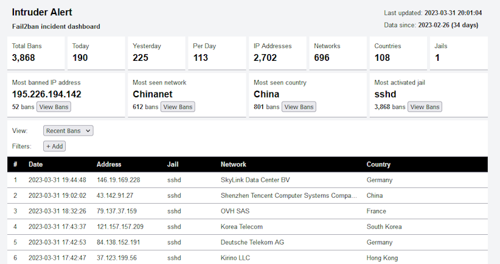

# Intruder Alert


Intruder Alert is an incident dashboard for Fail2ban.

## Demo

A demo is [available](https://verifiedjoseph.github.io/intruder-alert/demo/) and is built from the latest commit on the `main` brach.

## Installation

### docker-compose

<details>
<summary>Show/hide details</summary>

```yaml
version: '3'

services:
  app:
    image: ghcr.io/verifiedjoseph/intruder-alert:1.3.1
    container_name: intruder-alert
    environment:
      - IA_TIMEZONE=Europe/London
      - IA_MAXMIND_LICENSE_KEY=
      - IA_LOG_FOLDER=/app/backend/data/logs
    volumes:
      - path/to/fail2ban.log:/app/backend/data/logs/fail2ban.log:ro
      - path/to/fail2ban.log.1:/app/backend/data/logs/fail2ban.log.1:ro
      - path/to/fail2ban.log.2.gz:/app/backend/data/logs/fail2ban.log.2.gz:ro
      - path/to/fail2ban.log.3.gz:/app/backend/data/logs/fail2ban.log.3.gz:ro
      - path/to/fail2ban.log.4.gz:/app/backend/data/logs/fail2ban.log.4.gz:ro
    ports:
      - '127.0.0.1:8080:8080'
    cap_drop:
      - ALL
    security_opt:
      - no-new-privileges:true
```

</details>

### Manual

<details>
<summary>Show/hide install details</summary>

1) Download the [latest release](https://github.com/VerifiedJoseph/intruder-alert/releases/latest) to your web server and extract the zip archive.

2) Configure the application using `backend/config.php` copied from [`backend/config.example.php`](backend/config.example.php).
	
	```
	cp backend/config.example.php backend/config.php
	```

3) Create a scheduled task with cron (below) or similar that runs `backend\cron.php` at least once an hour.

	```
	1 * * * * php path/to/intruder-alert/backend/cron.php
	```

**Notes**

The backend folder does not need to be reachable in the browser and access should blocked. 

The scheduled task may need to run as root or a user with the permission to read the fail2ban logs.
</details>

## Configuration

Environment variables are used to adjust the configuration.

| Name                    | Type      | Description                                                                         |
| ------------------------| --------- | ----------------------------------------------------------------------------------- |
| `IA_LOG_PATHS`          | `string`  | Comma separated list of Fail2ban log files.                                         |
| `IA_LOG_FOLDER`         | `string`  | Path of the Fail2ban logs folder. Ignored if `IA_LOG_PATHS` is set.                 |
| `IA_MAXMIND_LICENSE_KEY`| `string`  | MaxMind license key for automatic GeoLite2 database downloads.                      |
| `IA_ASN_DATABASE`       | `string`  | Path of the GeoLite2 ASN database file.                                             |
| `IA_COUNTRY_DATABASE`   | `string`  | Path of the GeoLite2 Country database file.                                         |
| `IA_TIMEZONE`           | `string`  | Timezone of the dashboard ([php docs](https://www.php.net/manual/en/timezones.php)) |
| `IA_SYSTEM_LOG_TIMEZONE`| `string`  | Timezone of fail2ban logs (optional, default is UTC)                                |
| `IA_DASH_CHARTS`        | `boolean` | Enable/disable dashboard charts (optional, enabled by default).                     |
| `IA_DASH_UPDATES`       | `boolean` | Enable/disable automatic dashboard updates (optional, enabled by default).          |

### GeoLite2 databases

GeoLite2 databases will be automatically downloaded and updated if a [MaxMind license key](https://support.maxmind.com/hc/en-us/articles/4407111582235-Generate-a-License-Key) is set with `IA_MAXMIND_LICENSE_KEY`. 

Alternatively, the databases can be manually [downloaded](https://dev.maxmind.com/geoip/geolite2-free-geolocation-data?lang=en) and set using the environment variables `IA_ASN_DATABASE` and `IA_COUNTRY_DATABASE`.

## Development

Clone the repository.

```
git clone https://github.com/VerifiedJoseph/intruder-alert
```

Install PHP dependencies with composer.

```
composer install
```

Install JavaScript dependencies with npm.

```
npm install
```

### Commands

<details>
<summary>Show/hide commands</summary>

Lint code:
```
composer lint
npm run lint
```

Fix code:
```
composer fix
npm run fix
```

Build code:
```
npm run build
```

Live code build:
```
npm run watch
```

Test code:
```
composer test
```

</details>

## Dependencies

- PHP
	- [`geoip2/geoip2`](https://github.com/maxmind/GeoIP2-php)
	- [`tronovav/geoip2-update`](https://github.com/tronovav/geoip2-update)
- JavaScript
	- [Chart.js](https://github.com/chartjs/Chart.js/)
	- [Spacetime](https://github.com/spencermountain/spacetime)

## Requirements

- PHP >= 8.1
- Composer
- Node.js >= 18.0 (development only)

## Changelog

All notable changes to this project are documented in the [CHANGELOG](CHANGELOG.md).

## License

MIT License. Please see [LICENSE](LICENSE) for more information.
